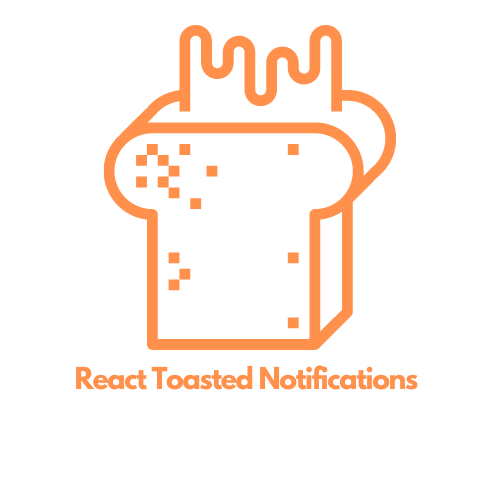

<div width="100%" align="center">
  
</div>

## Installation:

```shell
npm i react-toaster-notification --save

# or

yarn add react-toaster-notification
```

## Configuration

### On the root of the application.

```js
import { Notification } from "../src/";
// rest of the import

const App = (props) => {
  return (
    <Router>
      <App />
      <Notification />
    </Router>
  );
};
```

### When you want to use a notification.

```js
import { useNotification } from "../src/";
// rest of the import

export const Implementation = (props) => {
  const [, action] = useNotification();

  const handleNotification = () => {
    action.addNotification({
      title: "Warning",
      message: "Choose more strong password",
      type: "warning",
    });
  };

  return (
    <p>
      <button onClick={handleNotification}>Click</button>
    </p>
  );
};
```

### List of the props for global `Notification` component.

| prop     | default     | type   | function                              |
| -------- | ----------- | ------ | ------------------------------------- |
| timeout  | 5000        | Number | Global timeout value for notification |
| colors   | {...}       | Object | See possible default object.          |
| position | bottomRight | String | See possible value below.             |
| left     | undefined   | String | Padding left                          |
| right    | undefined   | String | Padding right                         |
| bottom   | undefined   | String | Padding bottom                        |
| top      | undefined   | String | Padding top                           |

<hr/>

- Possible value for position: `topRight, bottomRight, topLeft, bottomLeft`
- default color object:

```js
colors: {
    error: "#E44D4D",
    warning: "#F1AC12",
    info: "#3090FF",
    success: "#72C51B",
  }
```

### Configuration object for notification

| key     | value    | Options                                           |
| ------- | -------- | ------------------------------------------------- |
| title   | String   | " "                                               |
| message | String   | " "                                               |
| type    | String   | possible options: `info, success, error, success` |
| timeout | Number   | default: 5000                                     |
| OnClose | function | function when notification is removed             |
